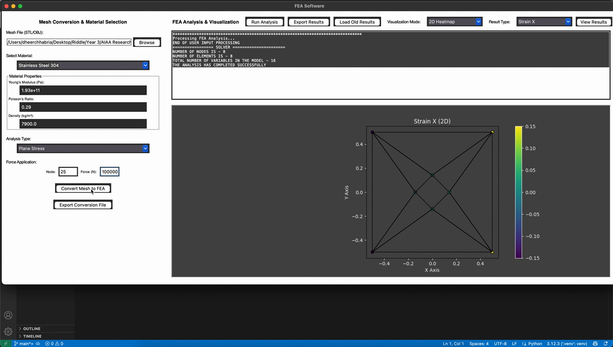
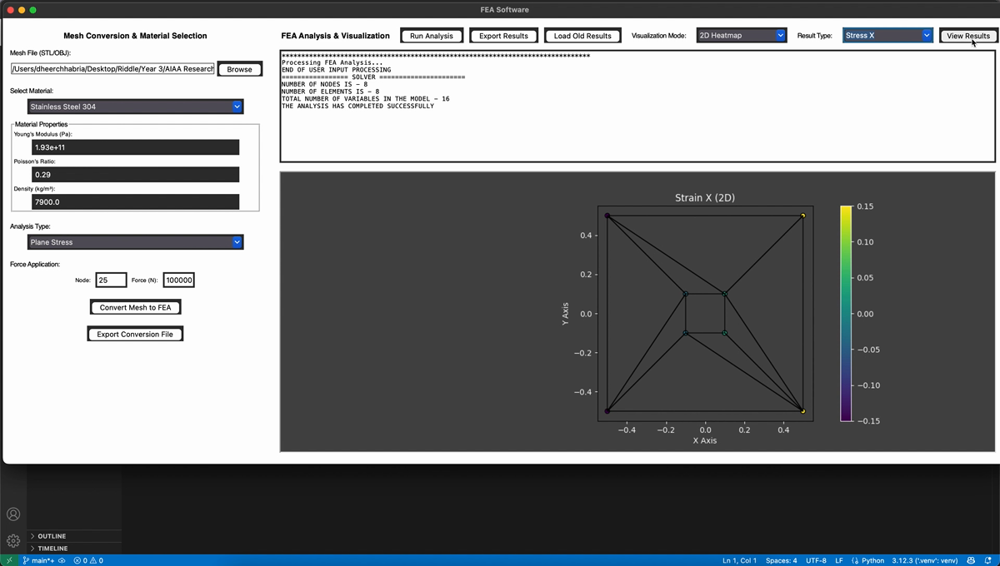

# SE300 Finite Element Analysis

A Python desktop application for converting planar STL meshes into an FEA
input format, configuring material and loading data, and visualizing results
over the imported mesh.



## Features

- Imports planar STL meshes
- Converts triangular and quadrilateral faces into FEA element records
- Supports plane-stress and plane-strain configurations
- Includes common aerospace and engineering materials
- Applies a force to a selected mesh node
- Constrains nodes along the mesh's left edge
- Displays result fields as 2D or 3D plots
- Exports conversion data and JSON results
- Reloads previously exported results

## Plate-with-hole example

The conversion pipeline supports meshes containing internal openings. The
outer left edge is selected for boundary constraints without constraining the
nodes surrounding the opening.



## Installation

The application requires Python 3.10 or newer and Tkinter.

```bash
git clone https://github.com/dc73/SE300Project.git
cd SE300Project
python -m venv .venv
source .venv/bin/activate
pip install -r requirements.txt
```

On Windows, activate the environment with:

```powershell
.venv\Scripts\activate
```

## Running the application

```bash
python appFEA.py
```

Then:

1. Select a planar `.stl` mesh.
2. Choose a material and analysis type.
3. Enter a valid node number and force.
4. Select **Convert Mesh to FEA**.
5. Select **Run Analysis**, choose a result and visualization mode, then select
   **View Results**.

The generated conversion file is named `INPUT_FEA_PROTUS_3.txt`. Conversion
and result files can also be exported from the application.

## Supported materials

- Aluminum 6061
- Titanium Ti-6Al-4V
- Carbon Fiber Composite
- Stainless Steel 304
- Inconel 718
- Mild Steel
- Copper
- Brass

Material properties are defined in `fea/materials.py` and can be extended by
adding another entry to `MATERIALS`.

## Project structure

```text
SE300Project/
├── appFEA.py                 # Application launcher
├── fea/
│   ├── app.py               # Tkinter interface and plotting
│   ├── computation.py       # Analysis input and result processing
│   ├── io.py                # FEA and JSON file operations
│   ├── materials.py         # Material property library
│   └── mesh.py              # Mesh conversion and constraints
├── examples/                # Python and MATLAB reference examples
├── tests/                   # Automated pipeline tests
└── docs/                    # Demo video and README images
```

## Testing

Run the automated test suite from the repository root:

```bash
python -m unittest -v
```

The tests cover conversion-file and JSON round trips as well as boundary
selection for the solid-plate and plate-with-hole geometries.

## Dependencies

- Matplotlib
- NumPy
- SciPy
- Trimesh

See `requirements.txt` for the installable dependency list.
